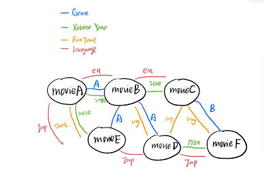

# SI507_FinalProject
## Configuration
Python Package: The project requests **flask**, **bs4**, **matplotlib**, **numpy**

## Runing Instructions
+ First of all you need the API key and Authorization. The data sources used in this project about relevant movie information are from the website called *TMDB*. You can register an API key on https://developer.themoviedb.org/reference/intro/authentication#api-key-quick-start. Then use your own key to replace the one in request.py for variable **header** and **movie_list_url**.
+ Then you can run the fetch_data.py to get the corresponding data sources. All the movie-relavent json files will be saved under a directory called movie_info. The terminal will show the total number of movie number and how many pages has the programme fetched. (If cache files already existed, this part of code won't run.) You can look at the terminal message for the detailed process.
+ After seeing the message "Preprocessing is done! Now you can run the main.py to start the web application.", you
can run main.py and open http://127.0.0.1:5000 to interatct with the web application!

## Interation Instructions
+ Choose your preference for the movies and click submit.
+ Wait for a second you will get a movie recommendation list ordered by "popularity". You can click the button "Try
   Again" to return to the home page to have another try.

## Data Structure
In this project the movie information is organized into the graph structure. Each movie represents a node and the edge connecting them represents two nodes that share the same property. 
Since there are 4 properties I am going to describe for a certain movie, I will give out four different graphs to store the data: the edge has different meaning in each graph.
I draw a brief ssketch map as followed:

